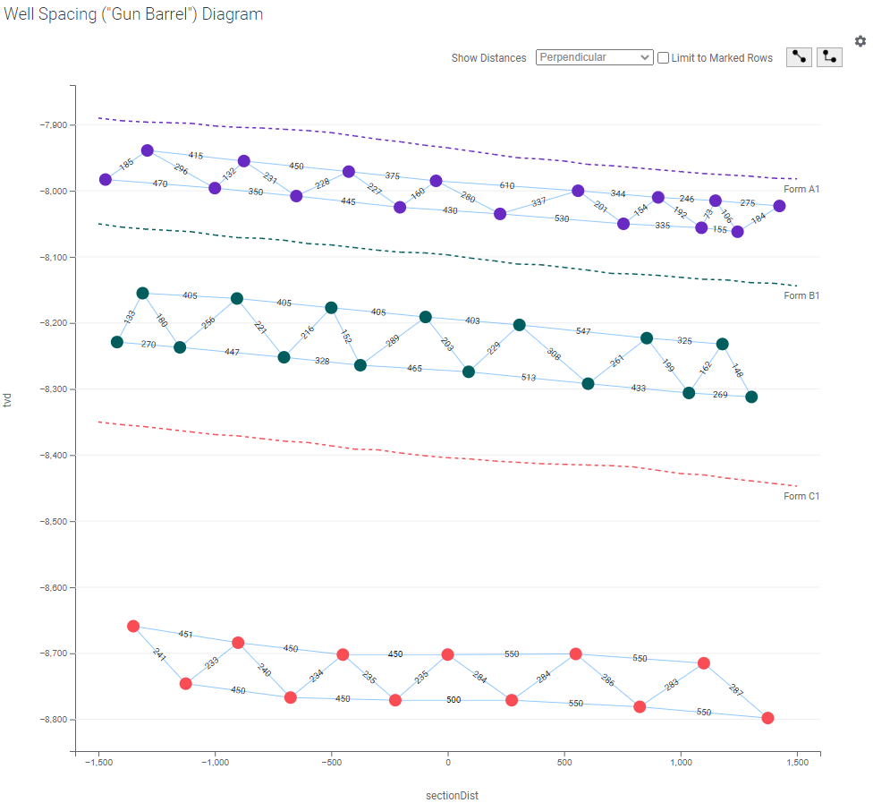
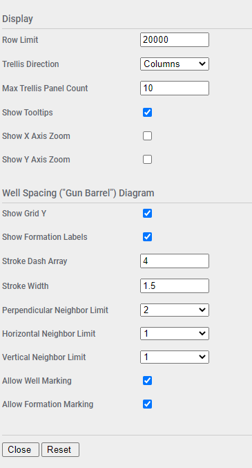
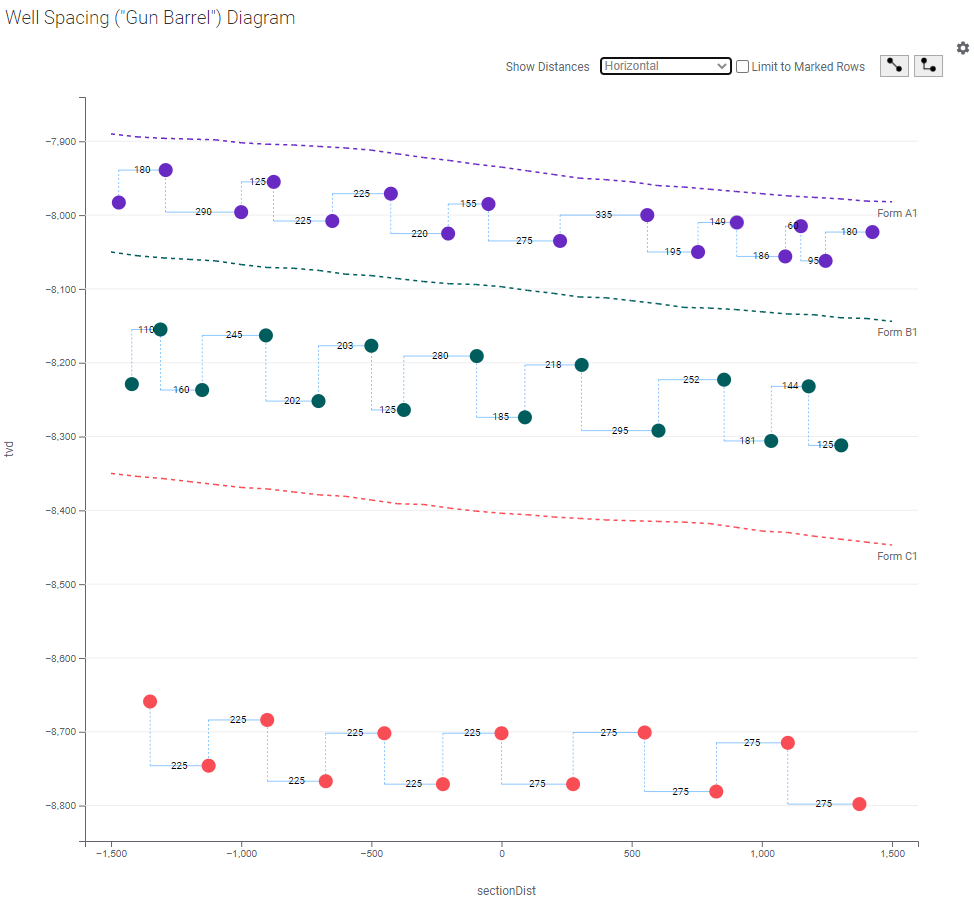
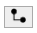
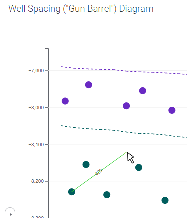

# Well Spacing ("Gun Barrel") Diagram Mod for Spotfire®

The Well Spacing ("Gun Barrel") Diagram Mod is used to visualize the spacing of horizontal wells across a lateral section, in relation to relevant formations. It provides measurements between wells to help in planning drilling and completions activities. This mod is used to display wells in what is known as a "gun barrel" view, because of how the wells are displayed. It represents a vertical section through the well, the same as if you were looking down a gun barrel.


## Try this mod in Spotfire® Analyst

### How to open the mod
1. Open Spotfire® Analyst, and create an analysis by loading some data.
1. Unzip the downloaded file, and locate the .mod file in the unzipped folder. 
1. Drag the file into the analysis. 
1. The visualization mod is added to the analysis.
1. To learn about the capabilities and limitations of this visualization mod, keep reading.

For general information on how to use and share visualization mods, [read the Spotfire documentation](https://docs.tibco.com/pub/sfire-analyst/latest/doc/html/en-US/TIB_sfire-analyst_UsersGuide/index.htm#t=modvis%2Fmodvis_how_to_use_a_visualization_mod.htm).

## Data requirements

Every mod handles missing, corrupted and/or inconsistent data in different ways. It is advised to always review how the data is visualized.

The Well Spacing ("Gun Barrel") Diagram Mod will draw a lateral section of wells and formations. In order to do this, a number of calculations will need to be performed up front from 3D trajectory survey data in order to generate the correct coordinates for rendering. 

* **True Vertical Depth (TVD)** - vertical distance from a surface reference point to the point being plotted.

* **Section Distance** - horizontal distance along the section to the point being plotted.

This data is required for both formations and wells.

## Setting up the Well Spacing ("Gun Barrel") Diagram

The Mod includes the following axes. Not all axis values are mandatory and this will be indicated.

### Trellis By

Optional. The Mod supports trellising with rows being grouped by the value in this axis. 

### Layer Type 

Mandatory. Must contain one of the following permitted values depending on row context.

* **formation** - identifies formation rows, linked together using Group By, and drawn as a line
* **wells** - identifies well rows, optionally linked together using Group By, and drawn as a point

Any other value will cause the row to be ignored.

### Group By 

Mandatory for formation rows. This value will group rows together to render as a single formation line.

Optional for wells rows. This value will group wells together for rendering adjacent distances. If omitted then all wells will considered to be be in the same group.

For example, if no grouping is specified for wells, the digram will render like this:


But if grouped, will render like this:



Note how the distances change.

To configure grouping for both formation and well rows it may be necessary to set the axis to an expression. For example:

```
Concatenate([layerType],"-",If([layerType]="formation",[name],[reservoir]))
```

### Name 

Optional. Display name for well rows to display when hovered with the mouse. No effect on formation rows.

### Size 

Optional. Sets the point radius for well rows. If omitted then a default will be used. No effect on formation rows.

### X 

Mandatory. The distance along the lateral section to render the formation point or the well.

### Y 

Mandatory. This true vertical depth (TVD) to render the formation point or the well.

### Color 

Optional. Sets the color of the formation line or well point. It may be necessary to use an expression here depending on requirements. For example, to color points the same color as associated formation, the following expression could be used:

```
If([layerType]="formation",[name],[reservoir])
```

## Configuring the Well Spacing ("Gun Barrel") Diagram

Additional configuration for the mod can be accessed by clicking on the small settings icon in the upper right corner of the visualization area. This will display the configuration properties over the visualization. Maximize the visualization if necessary to update the fields. The configuration panel will only be accessible when the analysis is in Editing mode. 



| Property | Description | Remarks |
| -------- | ----------- | ------- |
| Row Limit | Maximum number of rows to render | If the row count is exceeded then an error message will be displayed. This is a safety feature to keep from accidentally rendering too much data. |
| Trellis Direction | Direction for trellis panels | Columns or Rows |
| Max Trellis Panel Count | Maximum number of trellis panels to render | If the panel count is exceeded then an error message will be displayed. This is a safety feature to keep from accidentally rendering too much data. |
| Show Tooltips | Display tooltips | Applies to wells and formations |
| Show X Axis Zoom | Display X-axis zoom slider | |
| Show Y Axis Zoom | Display Y-axis zoom slider | |
| Show Grid Y | Display Y-axis grid |  |
| Show Formation Labels | Display formation labels | | 
| Stroke Dash Array | Dash array for formation lines | This follows the SVG standard for stroke dash array |
| Stroke Width | Line width for formation lines |  |
| Perpendicular Neighbor Limit | Number of display neighbors for perpendicular distances | | 
| Horizontal Neighbor Limit | Number of display neighbors for horizontal distances | | 
| Vertical Neighbor Limit | Number of display neighbors for vertical distances | | 


## Using the Well Spacing ("Gun Barrel") Diagram

Once the mod is configured it will render a lateral section of wells and formations positioned according to the X and Y axis configuration.

### Marking
The mod supports marking of well rows if configured. Click a well to mark it. Use CTRL-Click to add additional rows to the marking, or remove an already marked row. To clear the marking, click in any open area.

### Well Distances
To display distances between wells, select an option from the drop down. This will draw the distance between each well and it's  nearest neighbors within the same configured group. In the mod configuration the number of neighbors can be separately configured to 1 or 2 for each of the different display types.

* **Horizontal** - display a horizontal line and distance between a well and two nearest

* **Perpendicular** - display the shortest line between a well and two nearest

* **Vertical** - display a vertical line and distance between a well and two nearest

* **Vertical + Horizontal** - display both vertical and horizontal line and distance between a well and two nearest



### Limit to Marked Rows

If this checkbox is checked, then distances will only be displayed between the wells that are marked. Use CTRL-Click to add or remove wells from the marking set.


### Measuring Stick
The mod also includes a free-form measuring stick. Start by clicking one of the measuring toggles identified by these icons. It will turn dark grey once selected.

| Toggle    | Description |
| ---------- | ---------- |
|  | Straight line distance |
|  | Right-angle distance |

To use the measuring stick:

1. Select the desired measuring stick toggle
1. Click one of the well points
1. Move the mouse, the line and distances will be displayed
1. Hover over another well point, the distance and line will snap to the center
1. Click on another well to move the start point to that well
1. Or click in any open area to stop measuring




## Building the Project

In a terminal window:
- `npm install`
- `npm start`

In a new terminal window:
- `npm run server`

## More information about Spotfire® Mods

- [Spotfire® Visualization Mods on the Spotfire® Community Exchange](https://community.spotfire.com/files/category/7-visualization-mods/): A safe and trusted place to discover ready-to-use Mods
- [Spotfire® Mods Developer Documentation](https://spotfiresoftware.github.io/spotfire-mods/docs/): Introduction and tutorials for Mods Developers
- [Mods by Spotfire®](https://github.com/spotfiresoftware/spotfire-mods/releases/latest): A public repository for example projects


© Copyright 2024. Cloud Software Group, Inc.